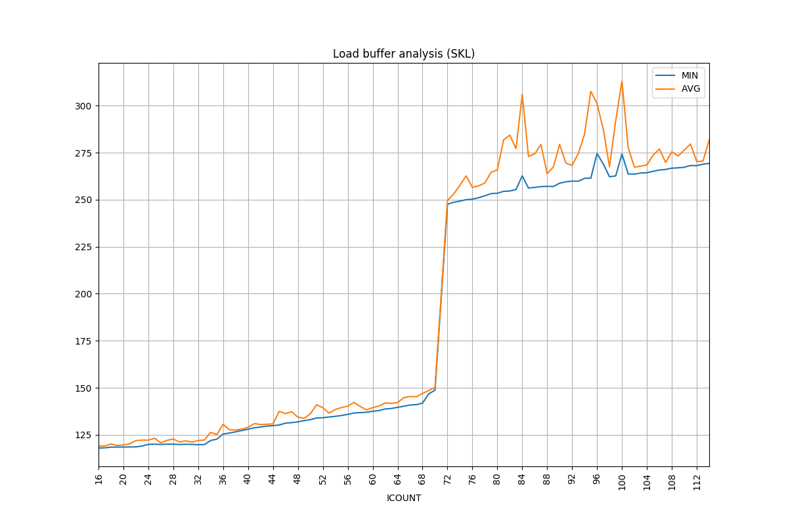

This is an updated copy of the [ROB](https://en.wikipedia.org/wiki/Re-order_buffer) size testing tool described by [Henry Wong on his blog](http://blog.stuffedcow.net/2013/05/measuring-rob-capacity) and reproduced here with permission. It includes one additional test (test 26) which uses AVX-512 `zmm` registers, and hence can measure the size of the 512-bit register file (spoiler: it seems to be the same size as the `ymm` and `xmm` register file, so nothing tricky going on).

Build it with `make` and run it like `./robsize ID` where `ID` is a test ID from 0 to 33 (run `./robsize --list` to show the available tests).

There are a few options that you can see with `./robsize --help`:

```
Usage: robsize [TEST_ID] [OPTIONS]

	--slow     			Run more iterations making the test slower but potentiallly more accurate
	--fast     			Run fewer iterations making the test faster but potentiallly less accurate
	--superfast			Run at ludicrous speed which is even less accurate than --fast
	--write-asm			Print the raw generated instructions to a file and quit
	--list     			List the available tests and their IDs
```

## Interesting Tests

There are currently 27 different tests, so here I'll quickly note which are the most interesting for determining the main parameters of your system.

A common theme is that many of the tests will probably detect the _same_ architectural feature (e.g., the ROB size), but do it in a slightly different way (e.g, with different type of nops, or different ALU operations, etc). One would expect them to give the same result, but if they give different results then they may reveal something interesting about the system. So the tests below aren't the _only_ ones that detect the particular feature!

All of the tests use the same basic structure: memory accesses that miss in the cache, separated by different types of operations (instructions). Only the operations vary, so when we say that a test "uses single byte NOPs" (for example), it is to be understood that the test consists as always of memory accesses separated by various amounts of single byte NOPs.

### Tests 1 and 4

These tests use single byte or double byte NOPs to detect the ROB size. They should both give the same answer, since only difference is that single byte NOPs tend to disable the use of micro-op cache since they are too dense, while double-byte NOPs use the cache. I wouldn't expect that to affect the apparent ROB size, but it's nice to be able to check!

### Test 0

This uses a series of general-purpose register additions, each one of which should consume a physical register, to test the size of the speculative register file.

### Test 11 and 19

These use SIMD xor operations (with different registers so it is not a zeroing idiom) to test the size of the SIMD register file. Test 11 uses SSE and xmm registers, while test 19 uses AVX2 and ymm registers. On the machines I am aware of, they give the same results but maybe one day it will be different!

### Test 32 and 33

These determine the load buffer (test 32) and store buffer (test 33) sizes respectively, by using loads and stores as the filler instructions.

## Plotting

You can plot the data for easy analysis using the included [plot-csv.py](plot-csv.py).

For example, the following command:

```
 ./robsize 32 --csv | head -n100 | ./plot-csv.py --xrotate=90 --tick-interval=4 --cols 1 2 --title="Load buffer analysis (SKL)"
 ```

 Generates this chart:

 

## References

H. Wong, _Measuring Reorder Buffer Capacity_, May, 2013. [Online]. Available: http://blog.stuffedcow.net/2013/05/measuring-rob-capacity/
